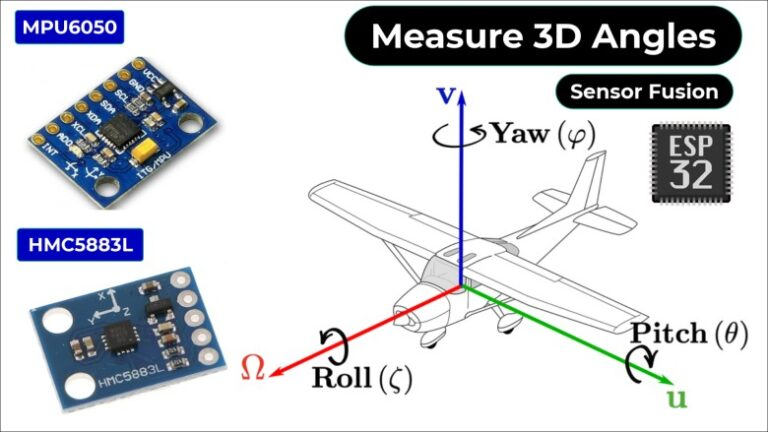
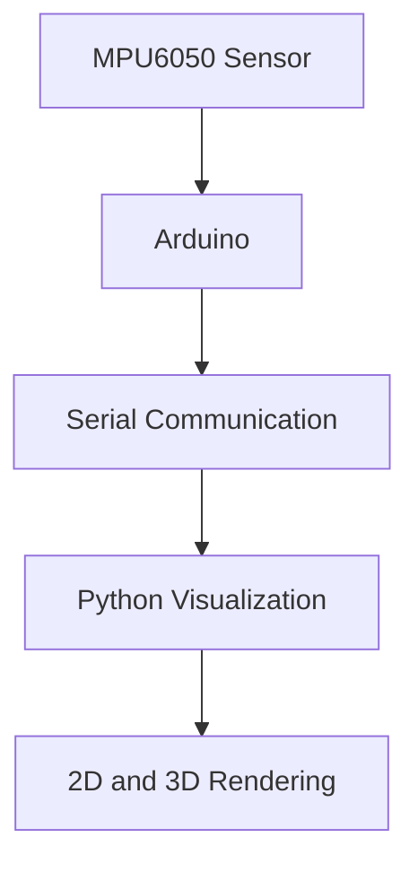
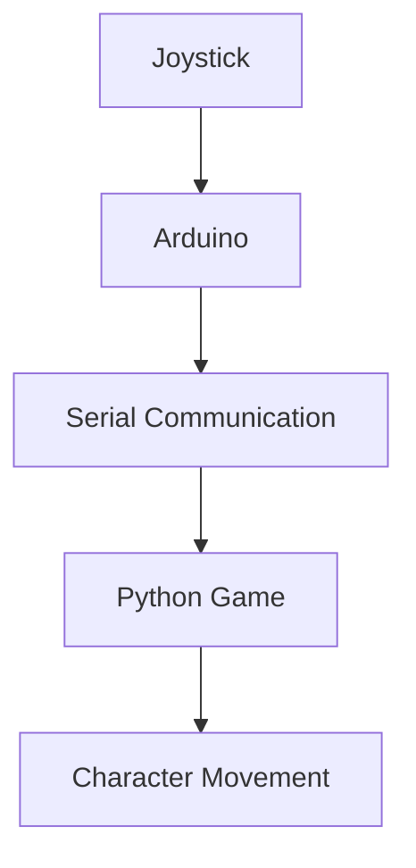
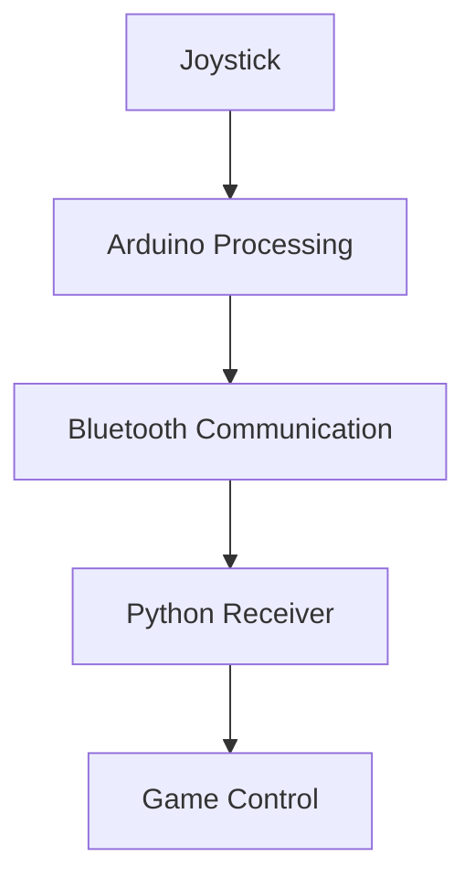
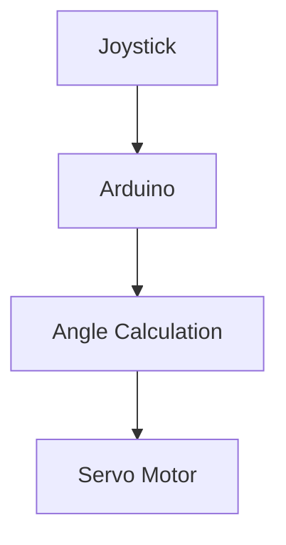
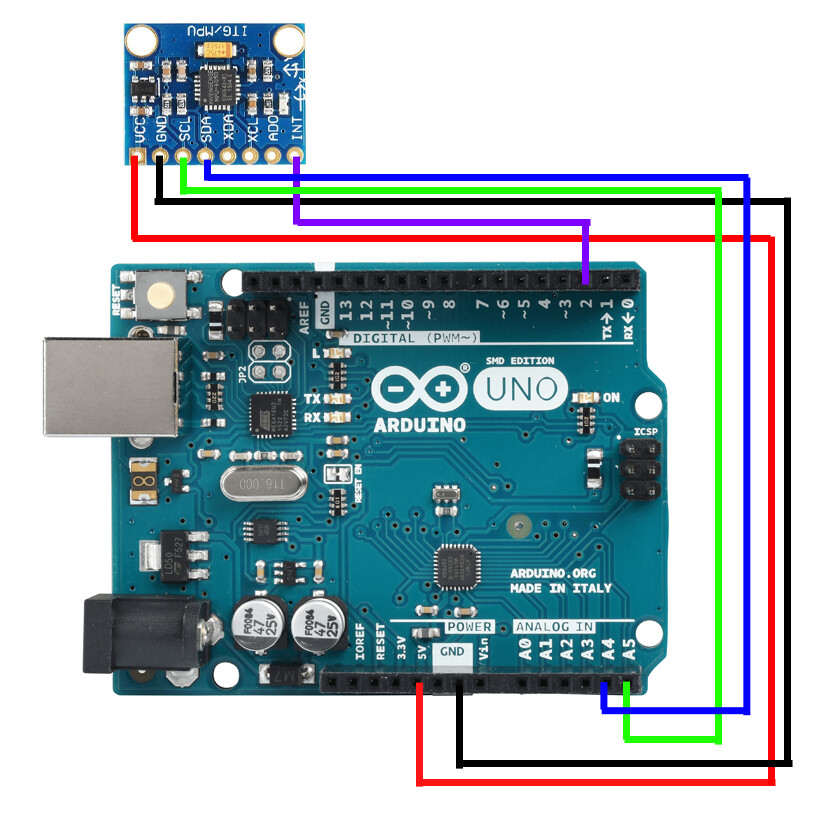
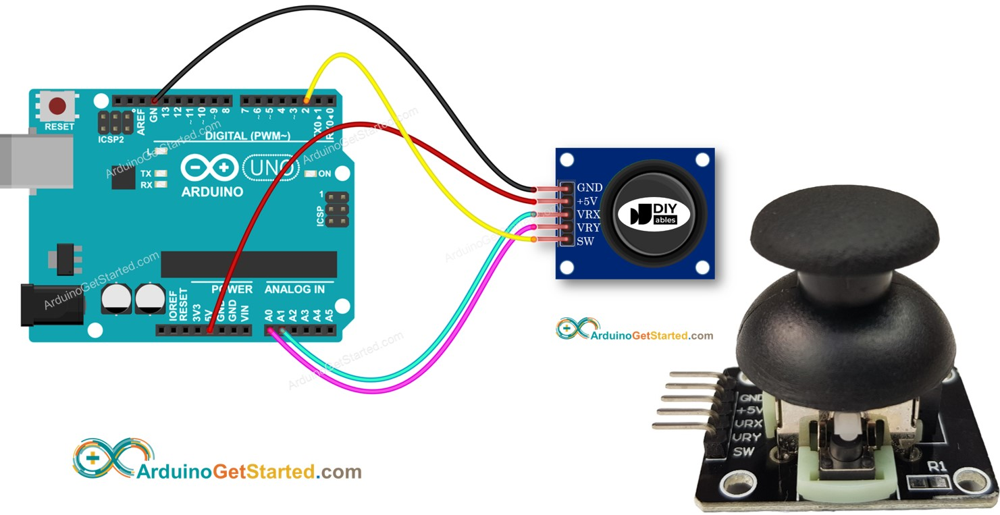
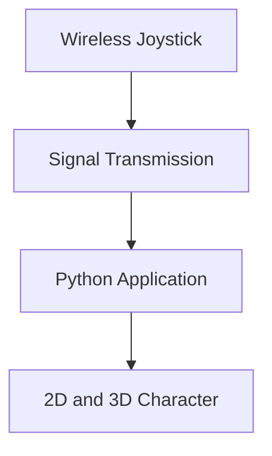

# EMBEDDED SYSTEMS Y2


A practical and hands-on collection of embedded systems projects focused on hardware interaction, sensor integration, wireless communication, real-time control systems, and data visualization.

This repository combines Arduino development, ESP-based communication, joystick-controlled systems, motion sensing with MPU6050, Bluetooth communication, Python-based visualization, and interactive control applications.

---

# Repository Overview

This repository contains multiple embedded systems mini-projects and experiments designed to:

* Understand microcontroller programming
* Learn hardware-software interaction
* Practice sensor integration
* Build wireless communication systems
* Visualize real-time sensor data
* Develop interactive control applications
* Explore serial communication between Arduino and Python
* Apply embedded systems concepts in real-world scenarios

The projects are structured for learning, experimentation, testing, and future expansion.

---

# Technologies Used

## Hardware

* Arduino
* ESP8266 / ESP-based modules
* MPU6050 Gyroscope & Accelerometer
* Joystick Modules
* Bluetooth Modules
* Servo Motors
* LEDs

## Software & Tools

* Arduino IDE
* Python
* Serial Communication
* Real-Time Data Visualization
* VS Code

## Programming Languages

* C/C++ (Arduino)
* Python
* Batch Script (.bat)

---

# Repository Structure

```bash
EMBEDDED SYSTEMS Y2/
│
├── Control-led-via-bluetooth/
├── Detect-Pitch-Roll-and-Yaw-using-MPU6050-main/
├── Esp2688/
├── JoyStick_game/
├── joystick-bluetooth\joystick/
├── JoystickServo control\joystick-servo/
├── MPU6050/
├── Pitch/
└── WirelessJoystockcontrol/
```

---

# 1. Control LED via Bluetooth


## Overview

This project demonstrates wireless LED control using Bluetooth communication between microcontrollers or external devices.

## Folder Path

```bash
Control-led-via-bluetooth/
```

## Files Included

```bash
receiver.ino
sender.ino
```

## Features

* Wireless LED control
* Serial communication
* Bluetooth command handling
* Real-time response system

## Learning Objectives

* Understand Bluetooth communication
* Learn serial data handling
* Control output devices wirelessly
* Build simple IoT interaction systems

## Possible Hardware Setup

* Arduino Uno/Nano
* HC-05 or HC-06 Bluetooth Module
* LEDs
* Resistors

## Workflow

```text
Phone App → Bluetooth Module → Arduino → LED Control
```


---

# 2. Detect Pitch, Roll, and Yaw using MPU6050



## Overview

This project detects and visualizes Pitch, Roll, and Yaw motion using the MPU6050 sensor and Python visualization scripts.

## Folder Path

```bash
Detect-Pitch-Roll-and-Yaw-using-MPU6050-main/
```

## Files Included

```bash
mpu6050_serial.ino
Pitch-Roll-Yaw-with-MPU6050.jpg
visualize_pitch_2d.py
visualize_pitch_roll_3d.py
visualize_pitch_roll_yaw_3d.py
```

## Features

* Real-time sensor reading
* Motion tracking
* 2D visualization
* 3D visualization
* Serial communication with Python

## Concepts Covered

* Accelerometer data
* Gyroscope data
* Orientation tracking
* Sensor fusion basics
* Data visualization

## System Flow

```text
MPU6050 Sensor
      ↓
Arduino Reads Motion Data
      ↓
Serial Communication
      ↓
Python Visualization
      ↓
2D / 3D Motion Rendering
```



## Example Applications

* Drone balancing systems
* Motion tracking
* Robotics orientation systems
* VR interaction systems
* Stability monitoring

## Suggested Image Section

```md

```

---

# 3. ESP2688

## Overview

This folder contains ESP-based experiments and wireless communication implementations.

The project focuses on:

* Wireless networking
* IoT communication
* ESP module programming
* Real-time communication systems

## Possible Features

* Wi-Fi communication
* Device networking
* Wireless control systems
* Remote data transfer

## Learning Objectives

* Understand ESP architecture
* Learn IoT fundamentals
* Explore wireless embedded systems

---

# 4. JoyStick Game


## Folder Path

```bash
JoyStick_game/
```

## Files Included

```bash
joystick_copy_20250924140006/
joystick_game.py
```

## Features

* Real-time joystick control
* Interactive gameplay
* Serial communication
* Hardware-to-software interaction

## Concepts Covered

* Input systems
* Real-time controls
* Serial data processing
* Game interaction logic

## Workflow

```text
Joystick Input
      ↓
Arduino Reads Values
      ↓
Serial Communication
      ↓
Python Game Engine
      ↓
Character Movement
```



## Example Use Cases

* Game controller systems
* Robotics control
* Interactive simulations

---

# 5. Joystick Bluetooth Control


## Folder Path

```bash
joystick-bluetooth/joystick/
```

## Files Included

```bash
bluetooth.ino
game.py
joystick.ino
scanCOMPORT.py
sender.ino
```

## Features

* Wireless joystick transmission
* COM port scanning
* Game integration
* Bluetooth data transfer
* Interactive control system

## Components of the System

### joystick.ino

Reads joystick movement data.

### bluetooth.ino

Handles Bluetooth communication.

### sender.ino

Sends control signals.

### game.py

Processes input for gameplay or interaction.

### scanCOMPORT.py

Detects available serial communication ports.

## Full System Flow

```text
Joystick
   ↓
Arduino Processing
   ↓
Bluetooth Transmission
   ↓
Python Receiver
   ↓
Game / Application Control
```



## Learning Objectives

* Wireless controller design
* Multi-file embedded systems
* Serial port handling
* Hardware-software synchronization

---

# 6. Joystick Servo Control


## Folder Path

```bash
JoystickServo control/joystick-servo/
```

## Main File

```bash
joystick-servo.ino
```

## Features

* Analog input reading
* Servo motor control
* Real-time positioning
* Hardware interaction

## Concepts Covered

* PWM (Pulse Width Modulation)
* Servo motor operation
* Analog signal processing
* Control systems

## Workflow

```text
Joystick Movement
      ↓
Arduino Reads Analog Values
      ↓
Servo Angle Calculation
      ↓
Servo Motor Movement
```



## Example Applications

* Robotic arms
* Camera positioning systems
* Smart control mechanisms
* Automation systems

---

# 7. MPU6050 Experiments



## Folder Path

```bash
MPU6050/sketch_sep24a/
```

## Files Included

```bash
mpu5060.jpeg
sketch_sep24a.ino
game.py
```

## Features

* Sensor experimentation
* Motion detection
* Image references
* Interactive testing

## Included Image

```md

```

## Concepts Covered

* Accelerometer readings
* Gyroscope integration
* Motion-based applications
* Sensor calibration

---

# 8. Pitch Visualization

## Folder Path

```bash
Pitch/
```

## File Included

```bash
pitch.py
```

## Features

* Pitch angle tracking
* Real-time visualization
* Motion interpretation

## Learning Objectives

* Understand orientation systems
* Build visualization systems
* Interpret sensor movement data

---

# 9. Wireless Joystick Control



## Folder Path

```bash
WirelessJoystockcontrol/
```

## Files Included

```bash
character_3d.py
character.py
launcher.bat
```

## Features

* Wireless interaction
* 2D/3D character control
* Launcher automation
* Real-time movement systems

## File Descriptions

### character.py

Controls a character or object using joystick input.

### character_3d.py

Provides 3D visualization or movement rendering.

### launcher.bat

Automatically launches required processes or scripts.

## Workflow

```text
Wireless Joystick
        ↓
Signal Transmission
        ↓
Python Application
        ↓
2D / 3D Character Movement
```



## Concepts Covered

* Wireless control systems
* Interactive visualization
* Automation scripts
* Real-time rendering

---

# Visual Preview Section

## Repository Visuals

| Project               | Preview                                           |
| --------------------- | ------------------------------------------------- |
| Bluetooth LED Control |             |
| Pitch Roll Yaw System |  |
| Joystick Game         |         |
| Servo Control         |                 |
| MPU6050 Module        |              |
| Wireless Controller   |        |

---

# Images and Media

You can create an `images/` folder to organize screenshots and demonstrations for each project.

Recommended structure:

```bash
images/
│
├── bluetooth-led.png
├── pitch-roll-yaw-demo.png
├── joystick-game.png
├── servo-control.png
├── wireless-controller.png
└── mpu6050-module.png
```

Example image usage inside README:

```md

```

---

# How to Run the Projects

## Arduino Projects

1. Open Arduino IDE
2. Connect the board
3. Select COM Port
4. Upload `.ino` file
5. Open Serial Monitor if needed

## Python Projects

Install dependencies:

```bash
pip install pyserial pygame matplotlib numpy
```

Run a Python file:

```bash
python filename.py
```

---

# Required Libraries

## Arduino Libraries

* Wire.h
* Servo.h
* MPU6050 Library
* SoftwareSerial.h

## Python Libraries

* pyserial
* pygame
* matplotlib
* numpy

---

# Skills Developed in This Repository

This repository helps develop skills in:

* Embedded Systems
* IoT Development
* Sensor Integration
* Serial Communication
* Python Visualization
* Robotics Fundamentals
* Hardware Debugging
* Wireless Communication
* Motion Tracking
* Real-Time Systems

---

# Future Improvements

Possible future upgrades:

* Add OLED/LCD displays
* Add mobile applications
* Add Wi-Fi dashboards
* Improve 3D visualization
* Add cloud integration
* Build full robotic systems
* Implement AI-based motion analysis
* Add multiplayer wireless gaming

---

# Educational Purpose

This repository is built mainly for:

* Learning Embedded Systems
* Academic Projects
* Hardware Experiments
* Practice and Research
* Understanding Real-Time Systems
* Exploring Human-Computer Interaction

---

# Contribution

Contributions, improvements, and ideas are welcome.

You can:

* Improve code structure
* Add documentation
* Optimize communication systems
* Improve UI/Visualization
* Add new embedded projects

---

# Author

## Igihozo Belise

Embedded systems enthusiast passionate about:

* IoT
* Full Stack Development
* Robotics
* Real-Time Systems
* Interactive Technologies
* Problem Solving Through Technology

---

# License

This repository is open for educational and learning purposes.

You may modify, learn from, and expand the projects responsibly.

---

# Final Note

This repository represents a growing embedded systems learning journey — combining hardware, software, communication systems, and interactive technologies into practical projects.

Each folder explores a different area of embedded systems engineering while building strong foundations in:

* Microcontrollers
* Sensors
* Wireless communication
* Real-time interaction
* Python integration
* System design

The projects are structured to encourage experimentation, creativity, and practical understanding of modern embedded technologies.
